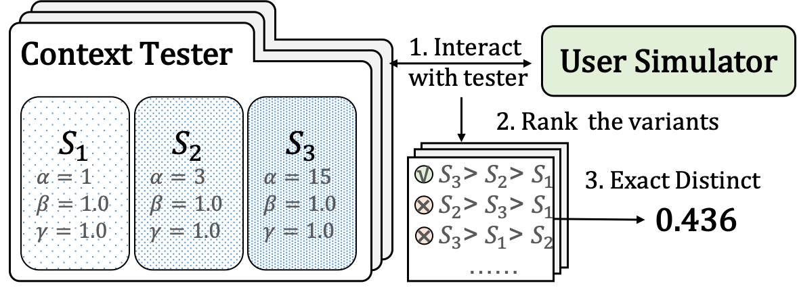

# Metaphorical User Simulators

We introduce a metaphorical user simulator (MetaSim) for 
end-to-end TDS evaluation (see `metasim/`).
We also introduce a Tester-based evaluation
framework to generate variants (see `system/`).
We additionally share the annotation website at `web/`.

The code is developed upon [pytorch](https://pytorch.org/) and [huggingface transformers](https://github.com/huggingface/transformers)

## MetaSim
The code for MetaSim is available at `metasim/`
* Metaphor retriever code at `metasim/metaphor.py` and `metasim/retrieval.py`
* Metaphor ranker training code at `metasim/train_rerank.py`
* Policy module training code at `metasim/train_policy.py`
* Training codes of other module (NLU, NLG, etc.) are aggregated at `metasim/train_mwoz.py`
* `metasim/preference.py` shows how we generate the user preferences, and `metasim/test_server.py` shows how the simulator interacts with systems

Usage of the code:
`python metasim/train_mwoz.py`

The code is still being cleaned up, and we will follow up with the driver code to make it easier to use.

## Tester
The code for Tester is available at system/ (we develop the systems based on [SOLOIST](https://github.com/pengbaolin/soloist))

* The training script:
`python system/train.py`

* The testing script:
`python system/decode.py`

* The evaluation metrics is available at `system/eval_metric.py`

The code is still being cleaned up, and we will follow up an interface that can be called `import tester` in pyhton.

## Dataset
We implement our models on [MultiWOZ](https://github.com/budzianowski/multiwoz), [ReDial](https://redialdata.github.io/website/), and [JDDC](https://jddc.jd.com/2019/jddc).
* We use the original entities' annotation on MultiWOZ 2.1
* We identify the entities in ReDial using [spaCy](https://spacy.io) and link them to [DBpedia](https://www.dbpedia.org/) (the linker is provided by [CR-Walker](https://github.com/truthless11/CR-Walker)).
* We identity the entities in JDDC using [LTP](https://github.com/HIT-SCIR/ltp) and link them to e-commerce knowledge provided by [Aliyun](https://cn.aliyun.com/)

## Website
The code for our annotation website is available at web/
`python web/server.py`

## Introduction
Task-oriented dialogue systems (TDSs) are assessed mainly by offline or human evaluation, either limited to single-turn or very time-intensive. Alternatively, user simulators that mimic user behavior enable us to enumerate user goals to generate human-like conversations for simulated evaluation. Employing existing user simulators to evaluate TDSs is challenging as user simulators are primarily designed to optimize dialogue policy for TDSs and have limited evaluation capability. Also, the evaluation of user simulators is an open challenge. This work proposes a metaphorical user simulator for end-to-end TDSs evaluation and a Tester-based evaluation framework to make dialogue systems with different capabilities, namely variants. Our user simulator constructs a metaphorical user model that assists the simulator in reasoning by referring to prior knowledge when encountering new items. We estimate the simulators by checking the simulated interactions between simulators and variants. Our experiments are conducted using three TDS datasets. The metaphorical user simulator demonstrates better consistency with manual evaluation on three datasets; our tester framework demonstrates efficiency, and our approach demonstrates better generalization and scalability.

## References
Metaphorical User Simulators for Evaluating Task-oriented Dialogue Systems

